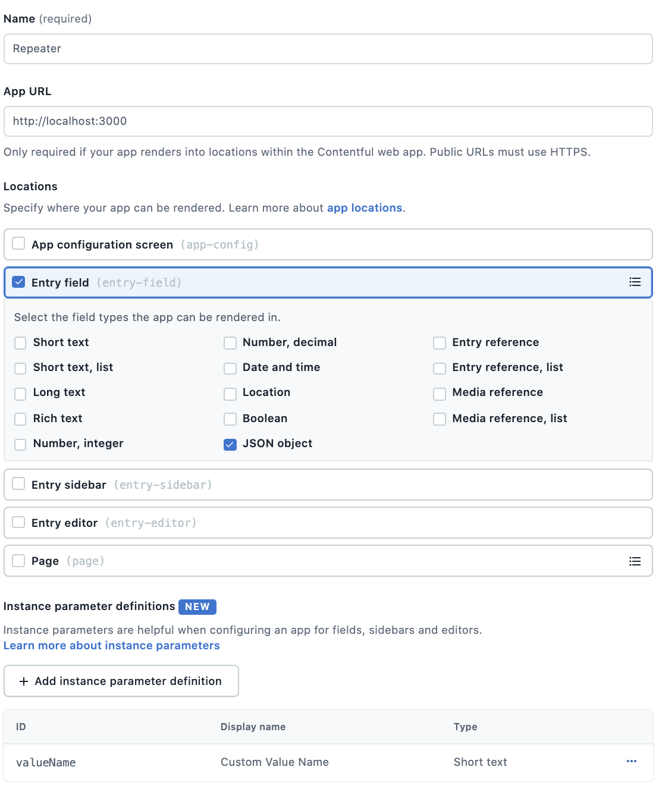

# Repeater App

The Repeater App creates a repeatable list of key-value pairs in the Contentful web app.
Key-value pairs are two pieces of associated information such as:

-   Ingredients list (Flour, 500 grams)
-   Item variations and amount in stock (T-Shirt, 5 left)
-   Statistics (Color variation, 5%)


The Repeater app utilizes the Contentful [JSON Field](https://www.contentful.com/developers/docs/concepts/data-model/#:~:text=JSON%20Object) to store a simple `Item` data stucture:

```ts
{
    id: string; // automatically generated by the app
    name: string;
    value: string;
}
```

*Note that the `id` property is automatically generated and useful for developers
to differentiate between different list items even if the labels are the same or similar*

An example item in the Contentful response:

```json
{
    "fields": {
        "ingredientsList": [
            {
                "id": "fisgh9s8e-sdfhap832",
                "name": "Flour",
                "value": "500g"
            },
            {
                "id": "asd7f82eiSUHDU-F0sudh4",
                "name": "salt",
                "value": "10g"
            }
        ]
    }
}
```
### Looking for Similar Functionality Using Reference Fields?
[Martin's Contentful Reference Matrix Field App](https://github.com/mgschoen/contentful-reference-matrix-field-app) is a continuation of this simple Repeater App
but uses the Contentful [Reference Fields](https://www.contentful.com/help/references/)
as a data source.
## To Learn More: Live Stream of the Prototyping of This App

On November 24th, 2020, Stefan and I did a live stream event where we built the prototype
for this app as a way to show developers the uses of the App Framework.

[Watch the stream](https://youtu.be/OtmV3TPTbRs)


## For Developers: Running This App Locally

> This project was bootstrapped with [Create Contentful App](https://github.com/contentful/create-contentful-app).

Before running the app locally, you will need to do 2 things:
* Ensure your Contentful user is admin or developer for the organization.
* Create an [`AppDefinition`](https://www.contentful.com/developers/docs/extensibility/app-framework/app-definition/)
in your organization with the following properties:
    * The App URL: http://localhost:3000
    * An entry field location with a type of JSON Object
    * An instance parameter of type short text with the id `valueName`

If you are using the UI to create the `AppDefinition`, it should look like this:




Once your app definition is created, running `npm start` will start a local server on
port 3000 (http://localhost:3000).

You must create or modify a content type which has a JSON field in order to see the app
inside of the Contentful web app.

## Learn More

[Read more](https://www.contentful.com/developers/docs/extensibility/app-framework/create-contentful-app/) and check out the video on how to use the CLI.

Create Contentful App uses [Create React App](https://create-react-app.dev/). You can learn more in the [Create React App documentation](https://facebook.github.io/create-react-app/docs/getting-started) and how to further customize your app.
